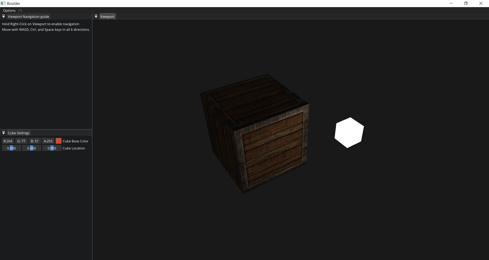

# HappySisyphus

My personal project creating a game engine. It might sound obsured but it makes me happy.

This project started by following _Hazel_ engine tutorials and then I added 3D rendering with OpenGL to it.

## Screen Shots

## Build

**Note**: For safety, binary files are not included in this repository. Download the following binaries from their official sources and place them in the specified directories:

- **premake.exe** → `.\vendor\bin\premake\`  
  [Official website](https://premake.github.io/)

- **assimp** → `.\Sisyphus\vendor\`  
  [Official website](https://assimp.org/)

- **build_assimp** → `.\Sisyphus\vendor\`  
  [Official website](https://assimp.org/)
